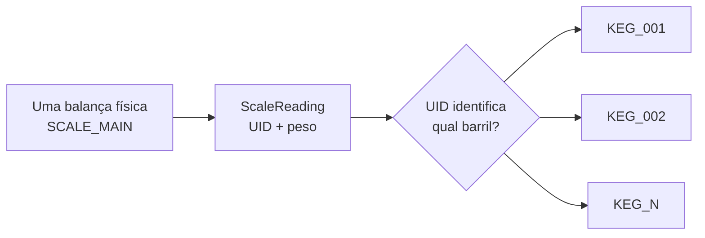
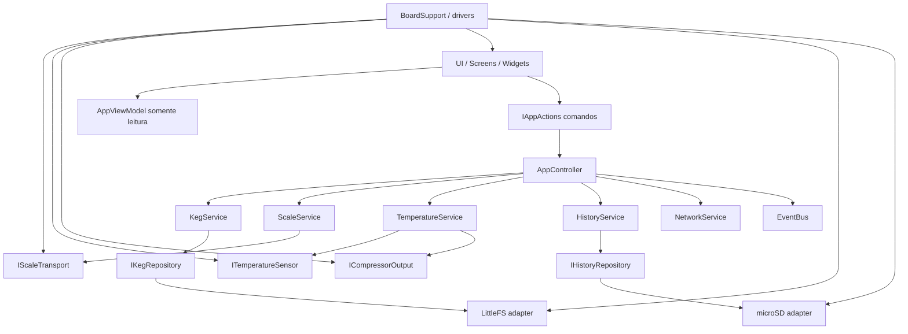
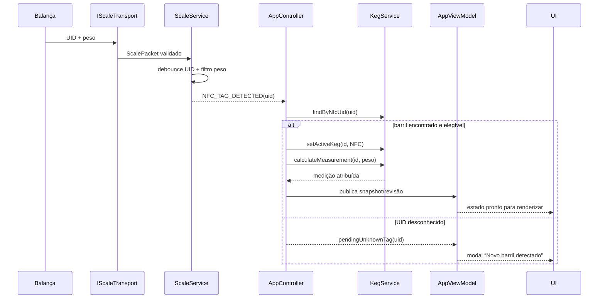
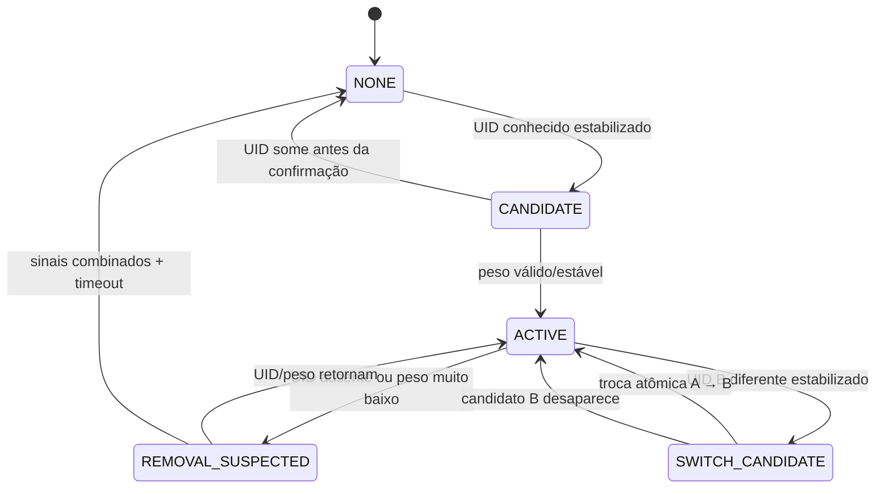
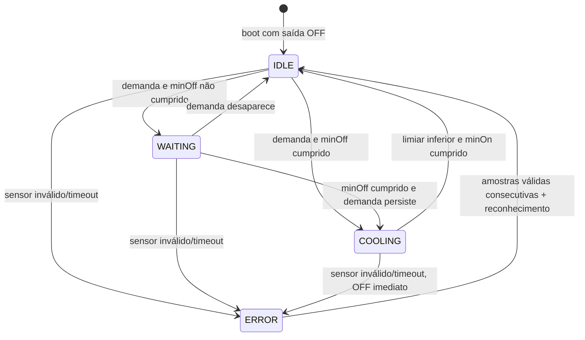

# Arquitetura do controlador inteligente de barris / keezer

**Fase:** 0 — Arquitetura  
**Status:** aprovada para orientar a Fase 1; nenhum firmware funcional foi implementado nesta fase  
**Alvo:** ESP32-2432S028R com módulo ESP32-WROOM-32, TFT 240 × 320 em portrait, touch resistivo e microSD  
**Data da decisão:** 2026-09-03

## 1. Objetivo e fronteira desta fase

Este documento transforma os requisitos do projeto em uma arquitetura implementável e testável. Ele define responsabilidades, dependências, modelos, invariantes, fluxos e decisões técnicas antes da criação do firmware.

Esta fase **não** implementa telas, drivers, comunicação real, persistência ou controle do compressor. A próxima fase deve criar apenas o projeto base, a camada de placa, o logger e os testes de display/touch/SD/serial descritos ao final deste documento.

## 2. Decisão fundamental: uma balança, vários barris

O sistema possui exatamente três conceitos distintos:

- `ScaleState`: estado do único dispositivo físico `SCALE_MAIN`;
- `Keg`: cadastro persistente de um barril;
- `ScaleReading`: medição momentânea produzida pela balança.

Não existe relação permanente “balança X pertence ao barril Y”. Uma leitura contém um NFC UID e pode ser atribuída temporariamente a um barril cadastrado. O vínculo físico atual é representado exclusivamente por `activeKegId`.



Invariantes obrigatórias:

1. Existe somente um `ScaleState` em memória, nunca uma coleção de balanças.
2. Podem existir vários `Keg`, limitados por uma capacidade configurada do produto.
3. Zero ou um barril pode estar ativo.
4. `activeKegId` é a autoridade sobre qual barril está fisicamente associado à leitura corrente.
5. Nenhum `Keg` armazena `scaleId`.
6. Uma leitura nunca altera outro barril que não seja o identificado/ativo.
7. Retirar, finalizar, arquivar e excluir são operações distintas.
8. Trocar o barril não remove cadastro nem histórico.
9. Histórico só é criado após uma leitura válida ser atribuída inequivocamente a um `kegId`.

## 3. Requisitos conflitantes, lacunas e riscos técnicos

### 3.1 Nome do hardware

“ESP32-2432S028” é a placa integrada; “ESP32-WROOM-32” é o módulo MCU presente nela. Eles não são dois controladores principais. O projeto considera uma única placa controladora ESP32-2432S028R baseada no ESP32-WROOM-32.

### 3.2 Variantes da placa e pinagem

Há revisões visualmente semelhantes (`ESP32-2432S028R`, v2, v3, micro-USB, USB-C e clones) com possíveis diferenças de backlight, touch, alimentação e pinagem. A revisão exata e o esquema elétrico da unidade física precisam ser registrados antes de congelar o `BoardConfig`.

O hardware físico foi posteriormente confirmado por inspeção como a revisão de dois USB (USB-C + micro-USB). Essa revisão usa ST7789 no conjunto GPIO 12/13/14/15/2, XPT2046 em 39/32/25/33/36, SD em 19/23/18/5 e RGB em 4/16/17. A identificação visual do controlador continua registrada como decisão de bring-up; compressor e sensores externos exigem validação elétrica separada.

### 3.3 Memória

O ESP32-WROOM-32 típico possui 520 KB de SRAM e 4 MB de flash, mas nem toda a SRAM fica disponível à aplicação; Wi-Fi, pilhas de protocolo, LVGL e drivers consomem parte relevante. A placa normalmente não possui PSRAM. Um framebuffer RGB565 completo ocupa:

`240 × 320 × 2 = 153.600 bytes`

Dois framebuffers completos são inadequados para este produto. A UI usará renderização parcial e ativos gráficos pequenos. A documentação oficial do módulo confirma 520 KB de SRAM e 4 MB de flash.

### 3.4 Barramentos SPI

TFT, touch e microSD aparecem em três grupos de pinos SPI, enquanto o ESP32 clássico disponibiliza dois controladores SPI de uso geral no ambiente Arduino. Isso cria risco de remapeamento/conflito entre touch e SD. Toda posse de SPI ficará dentro da camada BSP (`BoardSupport`), com transações serializadas. A Fase 1 deve testar as três combinações simultaneamente, não apenas cada periférico isolado.

A política candidata é:

- TFT em SPI por hardware, com DMA quando estável;
- microSD no outro SPI por hardware;
- XPT2046 por acesso leve compatível com a configuração da placa, possivelmente software SPI ou troca controlada de barramento;
- nenhuma tela, serviço ou repositório cria sua própria instância global de SPI.

A escolha exata entre software SPI para touch ou compartilhamento/remapeamento só será congelada após medição na placa real. O touch opera em baixa taxa e é o candidato natural a perder DMA, não o TFT nem o SD.

### 3.5 GPIO disponível para sensor e relé

A placa expõe poucos GPIOs livres. GPIO 21 costuma controlar o backlight e GPIO 35 é apenas entrada. A alocação candidata é GPIO 22 para o barramento 1-Wire e GPIO 27 para comando do relé, condicionada à conferência da revisão. O relé deve aceitar lógica de 3,3 V por circuito apropriado; nunca ligar uma bobina diretamente ao ESP32.

### 3.6 Segurança elétrica e funcional

Controle de compressor envolve tensão de rede, corrente de partida e risco de perda do produto. O firmware não é um dispositivo de segurança certificado. A instalação precisa de:

- relé/contator dimensionado para carga indutiva e corrente de partida;
- isolamento, fusível, caixa e aterramento adequados;
- estado físico padrão “compressor desligado” durante boot/reset;
- idealmente um termostato ou corte térmico independente em série;
- validação por profissional qualificado para a rede elétrica local.

Falha de sensor, software ou watchdog sempre desliga o comando lógico do compressor.

### 3.7 Tempo absoluto

O hardware especificado não inclui RTC. NTP melhora timestamps, mas não pode ser requisito para a operação térmica ou medição local. Cada registro histórico terá tempo monotônico e qualidade do relógio; quando houver horário válido, também terá UTC. Sem NTP/RTC após reinício, a ordem permanece confiável, mas data/hora civil não.

### 3.8 Firmware existente da balança

O firmware da balança foi validado e rearquitetado antes da Fase 15. A versão
instalada fornece o contrato HTTP v1 em `GET /api/v1/reading`, usa
`SCALE_MAIN`, peso inteiro em gramas, sequência monotônica, estabilidade,
uptime e UID NFC anulável. O contrato completo está em
`outputs/SCALE_PROTOCOL.md`; domínio, serviços e UI continuam independentes
do transporte.

### 3.9 Exclusão versus preservação de histórico

Excluir cadastro é excepcional. `archiveKeg()` é o fluxo normal. `deleteKeg()` exige autorização explícita, recusa o barril ativo e não apaga histórico por padrão. A purga de histórico será uma operação administrativa separada, também confirmada. Assim, uma exclusão acidental de metadados não destrói silenciosamente o histórico.

### 3.10 Sessão híbrida de acompanhamento

`KegTrackingService` mantém a referência do único KEG confirmado na balança e
processa somente novas leituras aceitas pelo `ScaleService`. A ativação vem de
um UID conhecido ou de uma pesagem manual confirmada; peso isolado nunca é
usado como identidade.

A sessão possui os estados `IDLE`, `ACQUIRING`, `MONITORING`, `PAUSED` e
`CHANGE_PENDING`. Uma queda acumulada de pelo menos 100 g, estável por 3 s e
separada da gravação anterior por pelo menos 30 s, produz uma medição com
origem `AUTO_TRACKING`. Comunicação indisponível pausa a sessão. Aumento de
300 g, mudança de pelo menos 2.000 g sem identidade validada ou conflito de UID
interrompem a automação e exigem confirmação.

O serviço de presença continua responsável por plataforma quase vazia, mas a
remoção por simples queda de 2.000 g fica desabilitada no modo híbrido. Essa
separação impede que consumo acumulado seja confundido com retirada do KEG.

## 4. Stack tecnológica

### 4.1 Build e framework

- PlatformIO;
- framework Arduino para ESP32, por compatibilidade madura com PlatformIO, Wi-Fi, Preferences, SD e bibliotecas escolhidas;
- C++17, sem exceções no fluxo normal e sem RTTI quando a cadeia de build permitir;
- dependências fixadas em versões exatas no `platformio.ini` da Fase 1;
- testes nativos no host para domínio e máquinas de estado; testes embarcados somente para drivers/BSP.

O código de domínio não dependerá de `Arduino.h`, `String`, GPIO, `millis()`, `Preferences`, `SD` ou LVGL. Adaptadores convertem APIs Arduino para interfaces próprias.

### 4.2 Biblioteca gráfica escolhida

**Decisão:** LVGL 9.5.0 para widgets/navegação + LovyanGFX 1.2.25 como backend de display/touch.

As bibliotecas cumprem papéis diferentes:

| Alternativa | Papel | Pontos fortes | Limitação para este projeto | Decisão |
|---|---|---|---|---|
| LVGL | framework completo de UI | widgets, foco, eventos, scroll, teclado, estilos, invalidação e navegação | exige configuração cuidadosa de RAM e um driver de hardware | selecionado como UI |
| TFT_eSPI | driver/desenho imediato | simples, rápido e amplamente usado | telas, widgets, teclado e navegação teriam de ser mantidos manualmente; o touch do CYD em barramento separado tem histórico de integração problemática | não será a base da UI |
| LovyanGFX | driver gráfico/touch | configuração programática, suporte a ESP32, touch, DMA e sprites | não substitui um framework de telas e formulários | selecionado como backend |

LVGL 9.5.0 é uma versão estável publicada em fevereiro de 2026. O modo `LV_DISPLAY_RENDER_MODE_PARTIAL` permite buffers menores que a tela e redesenha apenas áreas invalidadas. LovyanGFX suporta ESP32, ST7789, touch e transferências DMA, e sua configuração em código evita editar arquivos globais dentro de uma dependência.

Configuração inicial de memória da UI:

- buffer de saída `RGB565_SWAPPED`, pronto para o ST7789 e sem conversão no flush;
- portrait lógico 240 × 320, adotado após validação física e solicitação do usuário;
- teste atual com um buffer estático de 240 × 24 pixels: 11.520 bytes no total;
- buffers em RAM interna compatível com DMA;
- sem framebuffer completo;
- somente fontes e glifos usados pelo produto;
- imagens preferencialmente em flash e sem decodificadores pesados;
- animações curtas/opcionais; blur, sombras grandes e transparências extensas desabilitados;
- atualização por invalidação/revisão, não redesenho completo por loop.

Orçamento inicial a validar na Fase 3:

- heap livre em regime normal: alvo mínimo de 80 KB;
- menor heap livre observado: alvo mínimo de 60 KB;
- nenhuma queda contínua de heap em navegação repetida;
- interação perceptivelmente fluida, alvo de 20 FPS em transições e menos de 50 ms para resposta visual ao toque;
- uma tela criada por vez, mantendo apenas componentes globais mínimos.

### 4.3 Por que não usar `esp32-smartdisplay` como núcleo

Ele é útil como referência de pinagem e bring-up, mas adicionaria outra camada ampla que mistura definição de placa, drivers e integração LVGL. O projeto terá um BSP pequeno e explícito para controlar conflitos de SPI, comportamento do relé e variantes. Se os testes da Fase 1 mostrarem falha incontornável na integração LovyanGFX, o backend poderá ser substituído sem mudar `ui/`, graças a `IDisplayPort` e `ITouchPort`.

## 5. Estilo arquitetural

Arquitetura em camadas, dirigida por domínio, com portas e adaptadores:



Regras de dependência:

- `models` e `domain` não dependem de nenhuma camada externa;
- `services` dependem de modelos, contratos e repositórios abstratos;
- `storage`, `communication`, `temperature/drivers` e `bsp` implementam contratos;
- `ui` depende de `AppViewModel` e `IAppActions`, nunca de services ou hardware;
- `AppController` é a raiz de composição e coordena o loop;
- dependências apontam para dentro; adaptadores nunca são referenciados pelo domínio;
- objetos principais têm vida estática e propriedade clara; não usar singletons ocultos.

## 6. Tipos, unidades e limites

Para evitar erros de arredondamento e confusão de unidades, o domínio usa inteiros escalados:

- peso: `int32_t` em gramas;
- volume: `uint32_t` em mililitros;
- capacidade: `uint32_t` em mililitros;
- densidade: `uint16_t` em gramas por litro;
- temperatura: `int16_t` em centésimos de grau Celsius;
- porcentagem: `uint16_t` em centésimos de ponto percentual (`7100 = 71,00%`);
- tempo monotônico: `uint64_t` em milissegundos;
- tempo civil: `int64_t` Unix UTC em segundos, acompanhado de `TimeQuality`.

Conversões para `float` ou texto ocorrem somente no protocolo e no ViewModel. Cálculos intermediários de volume usam 64 bits.

Limites iniciais de produto, alteráveis antes da Fase 5:

- até 32 barris cadastrados;
- ID de barril: até 16 caracteres ASCII seguros;
- NFC UID normalizado: até 20 dígitos hexadecimais (UID de até 10 bytes), maiúsculo e sem separadores;
- nome: 32 caracteres UTF-8 limitados por bytes;
- estilo e lote: 32 caracteres cada;
- observações: 160 caracteres;
- peso aceito por padrão: 0 a 100.000 g;
- capacidade aceita por padrão: 1.000 a 100.000 mL;
- densidade aceita por padrão: 900 a 1.300 g/L;
- tara menor que o peso máximo esperado do conjunto.

Os limites impedem entrada malformada e permitem memória previsível. O máximo real da célula de carga deve substituir o limite genérico de 100 kg.

## 7. Modelos de domínio

### 7.1 `Keg`

```text
Keg
  id: KegId
  nfcUid: optional<NfcUid>
  name: FixedText<32>
  beerStyle: FixedText<32>
  batch: FixedText<32>
  notes: FixedText<160>
  capacityMl: uint32
  tareGrams: int32
  densityGramsPerLiter: uint16
  lastMeasurement: optional<KegMeasurementSnapshot>
  lifecycleStatus: KegStatus
  createdAt: Timestamp
  filledAt: optional<Timestamp>
  activatedAt: optional<Timestamp>
  lastSeenAt: optional<Timestamp>
  schemaVersion: uint16
```

`KegStatus`:

- `AVAILABLE`: cadastrado e pronto, ainda sem evidência de armazenamento/uso;
- `ACTIVE_ON_SCALE`: ativo; permitido para no máximo um barril;
- `STORED`: fora da balança, preservando último estado;
- `EMPTY`: cálculo válido atingiu o limite configurado de vazio, sem encerrar o ciclo automaticamente;
- `FINISHED`: ciclo encerrado explicitamente;
- `CLEANING`: indisponível para ativação automática;
- `ARCHIVED`: oculto das listas principais.

Estados `FINISHED`, `CLEANING` e `ARCHIVED` não são ativados automaticamente por NFC sem uma ação explícita do usuário. `EMPTY` pode ser marcado automaticamente depois de confirmação temporal, mas não apaga nem finaliza o barril.

### 7.2 `ScaleReading`

```text
ScaleReading
  protocolVersion: uint8
  sequence: uint32
  scaleId: fixed "SCALE_MAIN"
  nfcUid: optional<NfcUid>
  weightGrams: int32
  stable: bool
  batteryPercentage: optional<uint8>
  rssiDbm: optional<int8>
  senderUptimeMs: uint64
  receivedAtMonotonicMs: uint64
```

É imutável depois de validada. Não contém dados de cerveja, tara, capacidade ou volume.

### 7.3 `ScaleState`

```text
ScaleState
  linkStatus: ONLINE | STALE | OFFLINE
  detectedNfcUid: optional<NfcUid>
  rawWeightGrams: optional<int32>
  filteredWeightGrams: optional<int32>
  stable: bool
  batteryPercentage: optional<uint8>
  rssiDbm: optional<int8>
  lastSequence: optional<uint32>
  lastUpdateMonotonicMs: optional<uint64>
  validationErrorCount: uint32
```

`connected` não será persistido nem duplicado: é derivado de `linkStatus`. Limiares padrão:

- `ONLINE`: idade da última leitura menor que 30 s;
- `STALE`: de 30 s até 5 min;
- `OFFLINE`: mais de 5 min ou nunca recebido.

Esses limiares pertencem a `SystemSettings`.

### 7.4 `KegMeasurement`

```text
KegMeasurement
  kegId: KegId
  rawWeightGrams: int32
  filteredWeightGrams: int32
  beerWeightGrams: uint32
  volumeMl: uint32
  percentageBasisPoints: uint16
  validity: MeasurementValidity
  receivedAtMonotonicMs: uint64
  utcSeconds: optional<int64>
  timeQuality: UNSYNCED | ESTIMATED | NTP_SYNCED | MANUAL
```

Esse tipo é o resultado de atribuir uma leitura a um barril. Ele separa a medição física do cálculo de negócio.

### 7.5 `HistoryRecord`

Versão compacta e versionada de `KegMeasurement`, com `recordSequence`, `bootId` e flags de qualidade. O histórico pertence ao `kegId`; `scaleId` não é parte da chave nem da estrutura de diretório.

### 7.6 `TemperatureState`

```text
TemperatureState
  currentCentiCelsius: optional<int16>
  sampleStatus: VALID | STALE | DISCONNECTED | OUT_OF_RANGE | ERROR
  controlState: IDLE | WAITING | COOLING | ERROR
  compressorOn: bool
  demandCooling: bool
  lastSampleMonotonicMs: optional<uint64>
  compressorChangedAtMs: uint64
  protectionRemainingMs: uint32
  fault: TemperatureFault
```

### 7.7 `SystemSettings`

Agrupa configurações versionadas:

- escala: timeouts, deadband, janela do filtro, limiar de mudança significativa, ausência NFC e peso de retirada;
- temperatura: setpoint, histerese, tempos mínimos, faixa válida e timeout;
- rede: modo station/AP, hostname e parâmetros não secretos;
- display: brilho, timeout e rotação;
- histórico: intervalo, delta mínimo e política de flush;
- touch: matriz/coeficientes de calibração e limiar de pressão;
- logging: nível ativo;
- `demoMode`.

Segredos, como senha Wi-Fi e token da balança, ficam em namespace NVS separado e nunca entram em logs ou ViewModel.

## 8. `KegService`

Responsabilidade: catálogo, regras de ciclo de vida, exclusividade do ativo, associação NFC e cálculos específicos do barril.

API conceitual:

```text
createKeg(draft) -> Result<KegId, KegError>
updateKeg(id, patch) -> Result<void, KegError>
archiveKeg(id) -> Result<void, KegError>
deleteKeg(id, DeleteAuthorization) -> Result<void, KegError>
findById(id) -> optional<KegView>
findByNfcUid(uid) -> optional<KegId>
getAllKegs(filter, page) -> KegPage
setActiveKeg(id, ActivationSource) -> Result<ActivationChange, KegError>
removeActiveKeg(RemovalReason) -> Result<optional<KegId>, KegError>
getActiveKeg() -> optional<KegView>
attachNfcTag(id, uid) -> Result<void, KegError>
detachNfcTag(id) -> Result<void, KegError>
calculateMeasurement(id, filteredWeight) -> MeasurementResult
finishKeg(id) -> Result<void, KegError>
markEmpty(id) -> Result<void, KegError>
```

Regras internas:

1. ID e NFC UID são únicos.
2. Uma NFC não pode estar associada a dois barris.
3. `setActiveKeg()` é a única operação que cria o estado ativo.
4. Ao ativar B enquanto A está ativo, a transição ocorre atomicamente em memória: salva o último snapshot de A, muda A para `STORED`, ativa B e só então publica eventos.
5. Em falha de persistência, a alteração não é anunciada como concluída; o serviço mantém ou restaura o último estado coerente.
6. Barril arquivado/finalizado/em limpeza exige confirmação para reativação.
7. `removeActiveKeg()` muda `ACTIVE_ON_SCALE` para `STORED`, exceto quando outra transição explícita (`FINISHED`, por exemplo) já tiver precedência.
8. `finishKeg()` remove o vínculo ativo, encerra o ciclo e preserva snapshots/histórico.
9. `deleteKeg()` nunca é chamado por detecção física.
10. No boot, `KegService` reconcilia o snapshot persistido; se detectar mais de um status ativo por corrupção, mantém apenas o `activeKegId` válido e registra `STORAGE_ERROR`.

### 8.1 Cálculo de volume

```text
beerWeightGrams = max(0, filteredWeightGrams - tareGrams)
unclampedVolumeMl = beerWeightGrams * 1000 / densityGramsPerLiter
volumeMl = clamp(unclampedVolumeMl, 0, capacityMl)
percentageBasisPoints = volumeMl * 10000 / capacityMl
```

Validação ocorre antes do cálculo:

- leitura ausente, negativa ou acima do limite físico: inválida, não altera histórico;
- tara/capacidade/densidade fora dos limites: erro de cadastro, não calcular;
- peso abaixo da tara: resultado de volume zero com flag `BELOW_TARE`, após confirmar que a leitura é fisicamente válida;
- peso acima de `tara + capacidade × densidade + tolerância`: valor limitado para exibição, flag `ABOVE_EXPECTED_MAX` e alerta; não esconder o valor bruto;
- NFC desconhecido: nenhuma atribuição a barril;
- leitura instável pode alimentar diagnóstico, mas não histórico nem snapshot principal.

## 9. `ScaleService`

Responsabilidade: consumir uma única fonte de leituras, validar envelope físico/protocolo, manter `ScaleState`, filtrar peso, estabilizar NFC e emitir eventos neutros.

API conceitual:

```text
begin()
update(nowMs)
state() -> const ScaleState&
latestStableReading() -> optional<ScaleReading>
configure(ScaleSettings)
```

Dependências:

- `IScaleTransport`;
- `IClock` monotônico;
- `IEventSink`.

`ScaleService` **não** conhece `KegRepository`, capacidade, tara, cerveja, telas ou histórico.

Pipeline:

1. `IScaleTransport` recebe bytes;
2. `ScaleProtocol` valida versão, tamanho, campos, token e `scaleId`;
3. mensagens duplicadas/antigas são descartadas por `sequence`, considerando reinício por mudança de `senderUptimeMs`;
4. UID é normalizado e passa por debounce;
5. peso bruto válido entra no filtro;
6. `ScaleState` é atualizado;
7. eventos são enfileirados;
8. `AppController` decide a atribuição ao barril por meio do `KegService`.

### 9.1 Filtro planejado

A Fase 11 implementa:

- janela fixa de mediana com 5 amostras válidas;
- deadband padrão de 20 g aplicado à saída;
- somente amostras marcadas estáveis atualizam o peso publicável;
- sem alocação dinâmica;
- parâmetros configuráveis.

`rawWeightGrams` sempre conserva a última leitura aceita; `filteredWeightGrams` conserva a saída filtrada. Uma diferença entre saídas filtradas maior que o limiar configurado (inicialmente 2.000 g) gera `SIGNIFICANT_WEIGHT_CHANGE`, mas não exclui, finaliza ou troca barril por si só.

### 9.2 Debounce de NFC

- detecção: mesmo UID válido em pelo menos 3 mensagens consecutivas ou por 1,5 s;
- remoção: ausência de UID não é aceita por uma única mensagem;
- troca direta A → B: B também precisa estabilizar antes da transição;
- UID alternando rapidamente gera estado ambíguo e alerta de diagnóstico, sem trocar o ativo.

Os números são valores iniciais configuráveis, a validar com a frequência real da balança.

## 10. Transporte e protocolo inicial da balança

### 10.1 Abstração

```text
IScaleTransport
  begin()
  update(nowMs)
  isConnected() -> bool
  tryRead() -> optional<ScalePacket>
```

O callback conceitual `onScaleData()` será realizado como fila/poll (`tryRead`) para preservar execução cooperativa e evitar reentrância no domínio. Transportes futuros implementam o mesmo contrato.

### 10.2 Primeira implementação real

**HTTP REST local por consulta**, com a balança como servidor e o controlador
como cliente. Esta decisão substitui o esboço inicial de HTTP push depois da
validação do firmware real da balança:

```http
GET /api/v1/reading HTTP/1.1
Host: balanca.local
Accept: application/json
```

Payload v1:

```json
{
  "protocol_version": 1,
  "sequence": 1842,
  "scale_id": "SCALE_MAIN",
  "weight_grams": 18542,
  "stable": true,
  "nfc_uid": "04A23F891C",
  "rssi_dbm": -58,
  "uptime_ms": 12345678
}
```

Ausência de tag é representada por `"nfcUid": null`, nunca string vazia ambígua.

Decisões do protocolo:

- consulta a cada 500 ms e timeout de resposta de 1.000 ms;
- resposta HTTP completa limitada a 767 bytes no controlador;
- `sequence` oferece idempotência; snapshots repetidos não duplicam histórico;
- `uptime_ms` detecta reboot da balança, mas não é data civil;
- o controlador define `receivedAtMonotonicMs` local;
- somente `SCALE_MAIN` é aceito;
- campos desconhecidos são ignorados em uma mesma versão; campos obrigatórios ausentes rejeitam a mensagem;
- `nfc_uid: null` mantém o modo híbrido saudável quando não há tag ou PN532;
- HTTP 503 significa HX711 ainda sem leitura válida e não produz um pacote;
- respostas malformadas ou incompatíveis nunca alcançam `KegService`;
- a API v1 não possui autenticação e deve existir somente na LAN confiável, sem redirecionamento da porta 80 para a internet;
- logs nunca imprimem senha Wi-Fi.

Descoberta/rede:

- hostname preferido da balança `balanca.local`, resolvido via mDNS e mantido em cache;
- endereço IP configurável em `NetworkConfig.h` como alternativa ao mDNS;
- modo station preferido;
- a comunicação da balança não depende de internet ou servidor externo.

O contrato completo está em `SCALE_PROTOCOL.md`. WebSocket, UDP, ESP-NOW e
MQTT permanecem adaptadores futuros, sem alteração em `ScaleService`.

### 10.3 Propriedade da rede — Fase 16

`NetworkService` é o único dono lógico da conexão. Ele depende de
`INetworkAdapter`; no ESP32, `Esp32WiFiAdapter` encapsula `WiFi.begin()`,
desconexão, IP e RSSI. Uma tentativa dura no máximo 20 s e a reconexão usa
backoff de 5 s até 60 s sem bloquear o loop.

`HttpScaleTransport` não configura credenciais nem reconecta Wi-Fi. Ele observa
o estado do `NetworkService`, resolve o endpoint configurado e reinicia apenas
sua conexão quando a rede ou a configuração muda. Isso separa claramente
“Wi-Fi indisponível” de “balança indisponível”.

SSID, senha, hostname e endpoint da balança formam um bloco NVS versionado com
CRC32. A senha fica fora do snapshot do ViewModel e dos logs; a tela entrega
somente o valor novo digitado pelo operador. Os macros de compilação são
fallback de primeiro boot, não a configuração operacional definitiva.

## 11. Fluxo NFC e identificação



Fluxo de cadastro de tag:

1. UI envia intenção `beginNfcEnrollment(kegId)` a `IAppActions`;
2. `AppController` cria uma sessão temporária com timeout e UID inicialmente vazio;
3. `ScaleService` continua neutro e publica UIDs estabilizados;
4. o primeiro UID novo e válido vira candidato;
5. `KegService.attachNfcTag()` valida unicidade;
6. UI recebe resultado no ViewModel;
7. timeout/cancelamento não altera o cadastro.

A lista de UIDs recentes é um buffer RAM limitado com UID e instante. Não é cadastro persistente nem acesso direto da UI ao PN532.

Tag desconhecida:

- cria `PendingUnknownTag` no estado da aplicação;
- `CADASTRAR` abre um draft com UID preenchido;
- `IGNORAR` suprime o modal para aquele UID por período configurado, sem arquivar nem descartar leituras globais;
- nenhuma leitura de UID desconhecido é anexada ao histórico de outro barril.

## 12. Troca e retirada de barril

### 12.1 Máquina de reconhecimento físico



### 12.2 Confirmação de retirada

Uma leitura ruim nunca retira o barril. A retirada automática exige confirmação temporal e sinais combinados. Política inicial:

- forte: NFC ausente **e** peso abaixo de 1.000 g por 5 s;
- moderada: NFC ausente por 15 s e queda significativa compatível com retirada;
- inconclusiva: balança offline, NFC ausente com peso ainda compatível com barril, ou apenas peso baixo; manter o último ativo e marcar presença como incerta;
- timeout offline não muda cadastro automaticamente.

Os limites serão calibrados com a balança real. A ação manual `RETIRAR DA BALANÇA` sempre está disponível e registra `RemovalReason::MANUAL`.

### 12.3 Troca A → B

Quando um UID B conhecido se estabiliza enquanto A está ativo:

1. congelar último snapshot válido de A;
2. não atribuir a A nenhuma leitura já identificada como B;
3. validar se B pode ser ativado;
4. numa única transação de domínio, A passa a `STORED`, `activeKegId` muda para B e B passa a `ACTIVE_ON_SCALE`;
5. persistir snapshot do catálogo;
6. publicar `KEG_REMOVED_FROM_SCALE(A)` e `KEG_ACTIVATED(B)` na ordem;
7. calcular a primeira medição de B somente com tara/densidade/capacidade de B.

Se a persistência falhar, a UI mostra erro e o estado permanece coerente em memória; não se mistura medida. A recuperação no boot usa geração/CRC para escolher o último snapshot completo.

Ativação manual passa pelas mesmas regras, apenas com `ActivationSource::MANUAL`. Se um UID físico diferente continuar presente, a UI mostra conflito e pede confirmação; não fica alternando automaticamente.

## 13. Eventos

`EventBus` será uma fila circular estática, single-thread no loop principal. Eventos têm tipo, timestamp monotônico, origem e payload pequeno por união discriminada. Não armazenam `String` nem ponteiros para objetos temporários.

Eventos iniciais:

- escala: `SCALE_CONNECTED`, `SCALE_STALE`, `SCALE_DISCONNECTED`, `SCALE_DATA_RECEIVED`, `NFC_TAG_DETECTED`, `NFC_TAG_REMOVED`, `UNKNOWN_NFC_TAG`, `WEIGHT_UPDATED`, `SIGNIFICANT_WEIGHT_CHANGE`;
- barril: `KEG_CREATED`, `KEG_UPDATED`, `KEG_ACTIVATED`, `KEG_REMOVED_FROM_SCALE`, `KEG_FINISHED`, `KEG_EMPTY`;
- térmico: `TEMPERATURE_UPDATED`, `COOLING_STARTED`, `COOLING_STOPPED`, `TEMPERATURE_SENSOR_ERROR`;
- infraestrutura: `STORAGE_ERROR`, `NETWORK_CONNECTED`, `NETWORK_DISCONNECTED`.

Políticas:

- produtores enfileiram; não chamam UI;
- consumidores executam rápido e sem I/O bloqueante;
- eventos repetitivos podem ser coalescidos (`WEIGHT_UPDATED`, `TEMPERATURE_UPDATED`);
- overflow incrementa contador, preserva eventos críticos e gera log rate-limited;
- eventos são sinais transitórios; o estado atual continua nos services/ViewModel;
- `IFeature.onEvent()` recebe uma visão somente leitura do evento.

## 14. `AppController`, `AppState` e `AppViewModel`

### 14.1 `AppController`

É a raiz de composição e orquestração. Responsabilidades:

- construir/adquirir dependências;
- executar inicialização em ordem segura;
- chamar `update()` cooperativamente;
- drenar eventos e coordenar workflows entre services;
- transformar intenções da UI em comandos;
- manter sessões temporárias (cadastro NFC, confirmação, modal);
- publicar snapshots no ViewModel;
- nunca desenhar widgets diretamente.

### 14.2 `AppState`

Guarda estado de workflow que não pertence a uma entidade:

- boot phase/degraded mode;
- `activeKegId` refletido do domínio;
- tag desconhecida pendente;
- sessão de cadastro NFC;
- confirmação modal;
- tela atual e navegação;
- status agregado de Wi-Fi, SD, relógio e demo;
- avisos ativos.

### 14.3 `AppViewModel`

Snapshot somente leitura, pronto para UI e sem ponteiros de domínio:

```text
AppViewModel
  revision: uint32
  currentTemperatureText
  temperatureSetpointText
  temperatureState
  compressorOn
  protectionRemainingSeconds
  scaleLinkStatus
  scaleLastUpdateSeconds
  detectedNfcUidText
  activeKeg: optional<ActiveKegVm>
  kegSummaries: paged fixed list
  pendingUnknownTag: optional<UnknownTagVm>
  wifiStatus / rssi
  sdStatus / freeSpace
  clockQuality
  alerts: fixed list
  diagnostics: heap / minHeap / uptime / fps / renderTime
```

Princípios:

- textos são pré-formatados fora das telas quando representam dados;
- `revision` permite que UI atualize apenas campos alterados;
- listas são páginas/resumos, não cópias irrestritas de arquivos;
- a UI nunca obtém senha, token, repositório ou handle de hardware;
- ações usam `IAppActions` (`saveKeg`, `setActiveKeg`, `setSetpoint`, etc.);
- resultado de comando retorna ao ViewModel, evitando callbacks de service na tela.

## 15. Armazenamento

### 15.1 Camadas

```text
ConfigRepository  -> NVS / Preferences
SecretRepository  -> namespace NVS separado
KegRepository     -> LittleFS, snapshot versionado A/B
HistoryRepository -> microSD, append por barril/período
```

Nenhuma chamada de `Preferences`, `LittleFS`, `SD` ou arquivo aparece em UI, models ou cálculo térmico.

### 15.2 Configurações em NVS

NVS é adequada a valores pequenos e possui wear leveling interno. Guardará configurações, calibração do touch, geração ativa do catálogo, último relógio conhecido e segredos. Escritas ocorrem somente quando o valor muda e, para sliders, após debounce/commit explícito.

Cada bloco possui:

- `schemaVersion`;
- `generation`;
- payload validado;
- CRC quando armazenado como blob;
- defaults seguros se ausente/corrompido.

### 15.3 Catálogo de barris em LittleFS

O catálogo multi-registro não será espalhado em dezenas de chaves NVS. `LittleFsKegRepository` usará dois snapshots compactos e versionados (`kegs_a.cbor`, `kegs_b.cbor`):

1. serializar em buffer limitado;
2. gravar o slot inativo;
3. fechar e reler cabeçalho/CRC;
4. marcar a nova geração como ativa em NVS;
5. conservar o slot anterior para recuperação.

No boot, o repositório escolhe a maior geração válida, mesmo que o ponteiro NVS tenha ficado inconsistente. Migrações de schema são explícitas e nunca sobrescrevem o único snapshot válido antes da validação.

### 15.4 Histórico no microSD

Estrutura lógica:

```text
/history/<kegId>/<YYYY-MM>.csv       quando UTC é válido
/history/<kegId>/unsynced-<bootId>.csv  sem relógio civil
```

CSV foi escolhido por recuperabilidade e inspeção simples. Campos incluem versão, sequência, boot ID, UTC opcional, monotônico, peso bruto/filtrado, volume, percentual e flags.

Política inicial de amostragem:

- considerar apenas medida estável, válida e atribuída;
- registrar no máximo uma amostra periódica por 60 s;
- registrar antes disso quando o volume mudar pelo menos 50 mL;
- registrar eventos de ativação, retirada, vazio e finalização;
- buffer RAM circular de 64 registros;
- flush a cada 32 registros ou 60 s, o que ocorrer primeiro;
- flush best-effort em transições relevantes e antes de reinício comandado;
- nunca gravar a cada pacote da balança.

Se o SD falhar:

- controle térmico e UI continuam;
- buffer RAM retém os registros mais recentes até seu limite;
- novos registros mais antigos são descartados com contador explícito quando lotado;
- `STORAGE_ERROR` e alerta aparecem;
- não usar flash interna como fallback contínuo de histórico, evitando desgaste;
- último snapshot do barril continua no catálogo em frequência limitada.

O gráfico lê janelas agregadas/decimadas; não carrega um arquivo inteiro na RAM.

### 15.5 Recuperação degradada do microSD

A partir da fase 17, falha de escrita classifica o histórico como `SD_MISSING`,
`SD_FULL` ou `SD_ERROR`. O `AppController` coordena uma remontagem não bloqueante
pelo `BoardSupport` a cada 15 segundos; após sucesso, o `HistoryService` descarrega
a fila RAM em ordem. Essa coordenação mantém o acesso ao barramento no BSP e as
regras de retenção no serviço.

Cada linha nova do histórico possui CRC32 próprio. A leitura aceita o formato
legado sem checksum, ignora apenas linhas danificadas e conserva os registros
válidos do mesmo arquivo. O catálogo interno mantém sua estratégia separada de
snapshots A/B: nunca formata automaticamente dados que já foram inicializados e
ficaram ilegíveis.

## 16. Temperatura e compressor

`TemperatureService` valida e envelhece amostras, transforma configurações em demanda térmica e publica o estado. `CompressorController` é a máquina de estados que possui a saída do compressor, a histerese e os relógios de proteção. Essa separação permite testar a proteção sem DS18B20, Wi-Fi ou UI e impede que uma leitura de sensor acione GPIO diretamente.

### 16.1 Interfaces

```text
ITemperatureSensor
  begin()
  update(nowMs)
  latestSample() -> TemperatureSample

ICompressorOutput
  beginSafeOff()
  setEnergized(bool)
  isEnergized() -> bool
```

`ITemperatureSensor` permite DS18B20, sensor remoto ou simulador. `ICompressorOutput` isola polaridade, GPIO e relé. A UI não conhece nenhum dos dois.

### 16.2 Máquina de estados

Parâmetros iniciais:

- setpoint: 2,00 °C;
- histerese total: 1,00 °C;
- ligar quando `T >= setpoint + hysteresis/2` (2,50 °C);
- desligar quando `T <= setpoint - hysteresis/2` (1,50 °C);
- tempo mínimo desligado: 180 s;
- tempo mínimo ligado: 60 s, configurável;
- timeout de sensor: 10 s;
- faixa plausível inicial: −20 a +50 °C.



Regras:

- boot inicializa relé OFF antes de Wi-Fi, display, SD ou sensor;
- min-off é medido por relógio monotônico e também vale após boot, salvo política de recuperação futura comprovadamente segura;
- min-on evita pulsos curtos, mas erro crítico de sensor sempre vence e desliga imediatamente;
- mudar setpoint não ignora proteção anti-ciclo;
- não usar `delay()`;
- exige múltiplas amostras válidas consecutivas para sair de `ERROR`;
- valores impossíveis e sentinelas do DS18B20 são erros, não temperaturas;
- estado e transições são testáveis no host com `FakeClock`.

### 16.3 Falhas e recuperação

Falhas: desconectado, CRC/leitura inválida, timeout, fora da faixa e repetição anormal. Em falha crítica:

1. compressor OFF;
2. estado `ERROR`;
3. evento e log rate-limited;
4. alerta persistente na UI;
5. recuperação apenas após janela configurada de amostras válidas.

## 17. UI, navegação e touch

### 17.1 Telas

- `HomeScreen`: freezer, todos os barris, scroll e novo barril;
- `KegDetailScreen`: dados, status e histórico visual do barril;
- `KegEditScreen`: formulário e associação NFC;
- `TemperatureScreen`: controle e proteção;
- `SettingsScreen`: categorias;
- `SystemScreen`: saúde do sistema;
- `DebugScreen`: métricas e simulador quando habilitado.

`ScreenManager` mantém a rota ativa e recria somente o conteúdo quando o usuário navega. O cabeçalho e o menu inferior permanecem fixos. `UIManager` conecta LVGL, ViewModel e ações.

### 17.2 Touch

Um único `TouchInput`/driver LVGL cuida de:

- leitura XPT2046;
- pressão mínima;
- debounce;
- transformação de coordenadas;
- rotação portrait;
- calibração de 5 pontos ou matriz afim;
- persistência da calibração em NVS;
- click, press, drag e scroll por mecanismos do LVGL;
- bloqueio de toque durante modal.

Telas não leem coordenadas cruas. Alvos interativos terão dimensão mínima aproximada de 44 × 36 px, ajustada após teste com touch resistivo.

### 17.3 Atualização

- serviços incrementam revisões quando estado visível muda;
- telas comparam revisão e atualizam apenas labels/barras afetadas;
- temperatura visual: no máximo 2 atualizações/s;
- peso/volume visual: após filtro/deadband, no máximo 5 atualizações/s;
- relógios relativos podem atualizar 1 vez/s;
- gráfico é redesenhado somente ao abrir, mudar período ou chegar agregado relevante.

## 18. Modo demonstração

`DEMO_MODE` implementará adaptadores, não condicionais espalhados:

- `DemoScaleTransport : IScaleTransport`;
- `DemoTemperatureSensor : ITemperatureSensor`;
- `MemoryKegRepository` opcional para testes;
- `NullCompressorOutput` obrigatório em demo.

Dataset inicial:

- German Pilsner / UID `04A23F891C` / 18,55 kg / 14,2 L / 71%;
- West Coast IPA;
- Vienna Lager;
- temperatura 2,3 °C, setpoint 2,0 °C, escala online.

Ações de debug geram os mesmos pacotes/eventos que hardware real: consumo, retirada, troca, UID desconhecido e offline. A UI e o domínio não sabem se a fonte é demo.

## 19. Loop cooperativo e agendamento

Estrutura lógica:

```text
loop:
  now = clock.nowMs()
  networkService.update(now)
  scaleTransport.update(now)
  scaleService.update(now)
  temperatureSensor.update(now)
  temperatureService.update(now)
  appController.processEvents(now, boundedCount)
  historyService.update(now)
  appController.refreshViewModel(now)
  uiManager.update(now)
  featureRegistry.update(now)
  diagnostics.update(now)
  cooperativeYield()
```

Cada módulo usa prazos monotônicos (`if now >= nextRun`) e retorna rapidamente. Nenhum `delay()` na aplicação. Operações potencialmente lentas de SD são limitadas e medidas. FreeRTOS adicional só será introduzido se medições demonstrarem que I/O bloqueia UI/controle; o uso interno do framework não obriga criar tasks próprias.

Prioridade lógica, mesmo em um loop:

1. segurança do compressor;
2. ingestão/idade de sensores;
3. eventos de domínio;
4. persistência;
5. UI/animações;
6. diagnóstico.

## 20. Logging e diagnóstico

Logger com `ERROR`, `WARN`, `INFO`, `DEBUG`, compilável sem debug. API aceita formatos/buffers fixos e não registra segredos. Eventos repetitivos usam rate limit.

Métricas:

- heap livre e mínimo;
- maior bloco livre quando disponível;
- uptime/boot reason;
- watchdog/reset reason;
- duração média/máxima do loop;
- FPS aproximado e tempo de renderização;
- duração/falhas de flush SD;
- espaço do SD;
- Wi-Fi RSSI/reconexões;
- idade da balança e sensor;
- pacotes inválidos/duplicados;
- eventos perdidos;
- registros históricos descartados.

`DebugScreen` é opcional em produção e nunca expõe token/senha.

### 20.1 Instrumentação e otimização medida — Fase 18

As métricas são agregadas em janelas de 30 segundos para não inundar o serial.
`UIManager` mede heap livre, mínimo histórico, maior bloco, fragmentação, chamadas
ao handler LVGL, FPS e flushes do display. `AppController` mede duração média e
máxima do loop e conta execuções acima de 10 ms. `SdHistoryRepository` mede
quantidade, bytes, falhas e tempo das leituras e escritas.

A primeira medição disponível mostrou aproximadamente 1,4 milhão de chamadas a
`lv_timer_handler()` em 30 segundos. O gerenciador agora só é executado quando
vence o prazo devolvido pelo LVGL, limitado a 5 ms para manter o touch
responsivo. A observação física de atraso durante a rolagem justificou uma
segunda otimização: leitura do touch a cada 10 ms, refresh a cada 20 ms, início
do arraste após 5 pixels, buffers de 12 linhas e SPI do ST7789 a 60 MHz.

O ensaio seguinte preserva o mesmo orçamento de 11.520 bytes, reorganizado em
um único buffer de 24 linhas, e usa o clock de 80 MHz que apresentou melhora
leve na bancada. A mudança reduz o número de faixas DMA por refresh e permanece
isolada da lógica de negócio. Como o LVGL pode reutilizar um buffer único assim
que recebe `flush_ready`, o BSP espera a conclusão de cada faixa DMA antes de
liberá-la; isso impede corrupção dos pixels ainda em trânsito.

O vídeo de bancada posterior identificou o artefato remanescente como *screen
tearing*: o painel varria uma imagem enquanto o LVGL gravava a próxima. Como a
placa não expõe um pino TE dedicado, o BSP consulta `GET_SCANLINE` (comando
0x45 do ST7789) pelo SPI e inicia a sequência de faixas logo atrás da linha de
varredura. A atualização usa `pushImageDMA`, mantém uma transação externa por
ciclo LVGL e fecha a transferência somente após a última faixa. Se a leitura
de scanline não responder ou falhar três vezes, o driver desativa a espera e
continua automaticamente em DMA, evitando travar a interface. Durante drag ou
inércia, apenas a atualização visual de dados é adiada; os serviços continuam
executando normalmente. A resolução e os recursos visuais foram preservados.

O exemplar validado respondeu `FALLBACK`; este estado com LVGL parcial e DMA é a
referência restaurada para os próximos testes isolados de tearing.

## 21. Extensibilidade com `IFeature`

```text
IFeature
  begin(FeatureContext)
  update(nowMs)
  onEvent(const AppEvent&)
```

`FeatureRegistry` possui slots fixos, registra recursos em compile time e fornece somente interfaces mínimas no `FeatureContext`. Uma feature não acessa internals de outra, não controla relé diretamente e não modifica repositórios sem passar por comandos. A função futura não é inventada nesta fase.

## 22. Ordem de inicialização e modo degradado

1. configurar pino do compressor em estado seguro OFF;
2. iniciar logger/serial e relógio monotônico;
3. carregar configurações/defaults seguros;
4. iniciar catálogo LittleFS e reconciliar invariantes;
5. iniciar display/touch e mostrar progresso;
6. iniciar sensor térmico/controlador;
7. montar SD; falha não impede boot;
8. iniciar rede; falha não impede UI/controle local;
9. iniciar transporte da balança;
10. iniciar features e publicar ViewModel.

Falhas classificadas:

- fatais de segurança: não é possível garantir compressor OFF; impedir controle e alertar;
- degradadas: SD, Wi-Fi, balança ou relógio indisponível; continuar funções independentes;
- recuperáveis: reintentar sem bloquear, com backoff;
- dados corrompidos: escolher snapshot anterior/default e sinalizar, nunca assumir valores perigosos.

## 23. Estrutura completa de diretórios

```text
.
├── platformio.ini
├── partitions.csv
├── README.md
├── ARCHITECTURE.md
├── HARDWARE.md
├── SCALE_PROTOCOL.md
├── KEG_MODEL.md
├── STORAGE.md
├── TEMPERATURE_CONTROL.md
├── UI.md
├── TESTING.md
├── include/
│   ├── BuildConfig.h
│   └── lv_conf.h
├── src/
│   ├── main.cpp
│   ├── app/
│   │   ├── AppController.h/.cpp
│   │   ├── AppState.h
│   │   ├── AppViewModel.h/.cpp
│   │   └── IAppActions.h
│   ├── bsp/
│   │   ├── BoardConfig.h
│   │   ├── BoardSupport.h/.cpp
│   │   ├── DisplayPort.h/.cpp
│   │   ├── TouchPort.h/.cpp
│   │   ├── SdCardPort.h/.cpp
│   │   └── SpiCoordinator.h/.cpp
│   ├── core/
│   │   ├── Clock.h
│   │   ├── Result.h
│   │   ├── FixedText.h
│   │   ├── RingBuffer.h
│   │   └── Types.h
│   ├── models/
│   │   ├── Keg.h
│   │   ├── KegStatus.h
│   │   ├── ScaleReading.h
│   │   ├── ScaleState.h
│   │   ├── KegMeasurement.h
│   │   ├── HistoryRecord.h
│   │   ├── TemperatureState.h
│   │   └── SystemSettings.h
│   ├── domain/
│   │   ├── KegCalculator.h/.cpp
│   │   ├── WeightValidator.h/.cpp
│   │   └── KegRules.h/.cpp
│   ├── events/
│   │   ├── AppEvent.h
│   │   ├── EventBus.h/.cpp
│   │   └── EventTypes.h
│   ├── services/
│   │   ├── KegService.h/.cpp
│   │   ├── ScaleService.h/.cpp
│   │   ├── TemperatureService.h/.cpp
│   │   ├── HistoryService.h/.cpp
│   │   ├── StorageService.h/.cpp
│   │   ├── NetworkService.h/.cpp
│   │   └── TimeService.h/.cpp
│   ├── communication/
│   │   ├── IScaleTransport.h
│   │   ├── ScaleProtocol.h/.cpp
│   │   ├── HttpScaleTransport.h/.cpp
│   │   └── DemoScaleTransport.h/.cpp
│   ├── temperature/
│   │   ├── ITemperatureSensor.h
│   │   ├── ICompressorOutput.h
│   │   ├── CompressorController.h/.cpp
│   │   ├── Ds18b20Sensor.h/.cpp
│   │   ├── GpioCompressorOutput.h/.cpp
│   │   ├── DemoTemperatureSensor.h/.cpp
│   │   └── NullCompressorOutput.h/.cpp
│   ├── storage/
│   │   ├── IKegRepository.h
│   │   ├── IHistoryRepository.h
│   │   ├── IConfigRepository.h
│   │   ├── LittleFsKegRepository.h/.cpp
│   │   ├── SdHistoryRepository.h/.cpp
│   │   ├── NvsConfigRepository.h/.cpp
│   │   └── MemoryKegRepository.h/.cpp
│   ├── ui/
│   │   ├── UIManager.h/.cpp
│   │   ├── ScreenManager.h/.cpp
│   │   ├── Routes.h
│   │   ├── Theme.h/.cpp
│   │   ├── UiFormatters.h/.cpp
│   │   ├── screens/
│   │   │   ├── HomeScreen.h/.cpp
│   │   │   ├── KegDetailScreen.h/.cpp
│   │   │   ├── KegEditScreen.h/.cpp
│   │   │   ├── TemperatureScreen.h/.cpp
│   │   │   ├── SettingsScreen.h/.cpp
│   │   │   ├── SystemScreen.h/.cpp
│   │   │   └── DebugScreen.h/.cpp
│   │   └── widgets/
│   │       ├── Header.h/.cpp
│   │       ├── BottomNavigation.h/.cpp
│   │       ├── FreezerCard.h/.cpp
│   │       ├── KegCard.h/.cpp
│   │       ├── ProgressBar.h/.cpp
│   │       ├── InfoTile.h/.cpp
│   │       ├── ConsumptionChart.h/.cpp
│   │       ├── ActionButton.h/.cpp
│   │       ├── ScrollContainer.h/.cpp
│   │       ├── Modal.h/.cpp
│   │       ├── Keyboard.h/.cpp
│   │       └── NumericInput.h/.cpp
│   ├── features/
│   │   ├── IFeature.h
│   │   └── FeatureRegistry.h/.cpp
│   └── diagnostics/
│       ├── Logger.h/.cpp
│       └── Metrics.h/.cpp
├── test/
│   ├── native/
│   │   ├── test_keg_calculator.cpp
│   │   ├── test_keg_service.cpp
│   │   ├── test_weight_filter.cpp
│   │   ├── test_keg_switching.cpp
│   │   ├── test_temperature_state_machine.cpp
│   │   └── fakes/
│   └── embedded/
│       ├── test_display_touch.cpp
│       ├── test_sd.cpp
│       └── test_temperature_io.cpp
└── data/
    └── .gitkeep
```

Arquivos `.h/.cpp` são indicações de módulo, não obrigação de criar pares vazios antecipadamente. Cada fase cria apenas o necessário.

## 24. Estratégia de testes

Testes nativos obrigatórios:

- `calculateBeerWeight()`;
- `calculateVolume()`;
- `calculatePercentage()`;
- `validateWeight()`;
- `findByNfcUid()`;
- `setActiveKeg()` e `removeActiveKeg()`;
- troca A → B sem contaminação de dados;
- tentativa de dois ativos;
- UID duplicado;
- filtro/deadband e mudança significativa;
- ONLINE/STALE/OFFLINE com relógio falso;
- debounce e retirada com leituras ruins intermitentes;
- máquina térmica e tempos mínimos;
- sensor inválido durante `COOLING` força OFF;
- recuperação de snapshots A/B e schema inválido;
- idempotência de `sequence`.

Testes embarcados:

- TFT portrait e cores;
- touch cru/calibrado nos quatro cantos e centro;
- TFT + touch simultâneos;
- TFT + touch + SD simultâneos por pelo menos 30 min;
- backlight/RGB sem interferência;
- GPIO do relé inicia OFF em boot/reset;
- desconexão/reconexão do DS18B20;
- Wi-Fi durante render/SD;
- reinício durante gravação de catálogo/histórico.

Critérios gerais:

- build sem warnings relevantes;
- testes determinísticos sem hardware para domínio;
- sanitização de entradas de protocolo/arquivos;
- medição de heap e duração do loop em testes de integração;
- nenhuma dependência de internet para operação normal.

## 25. Decisões adiadas conscientemente

Não são lacunas acidentais; dependem da placa/firmware real:

- revisão e pinagem final do ESP32-2432S028R;
- política concreta de terceiro periférico SPI;
- modelo/capacidade da célula de carga;
- formato atualmente emitido pela balança e possibilidade de atualizar seu firmware;
- modelo elétrico do sensor térmico e relé/contator;
- credenciais/topologia Wi-Fi definitiva;
- necessidade de RTC físico;
- limiares reais de retirada e mudança significativa.

Essas decisões devem ser resolvidas por testes focados, sem alterar os contratos de domínio.

## 26. Critérios de aceite da Fase 0

- arquitetura confirma uma balança e N barris: atendido;
- balança, barril e leitura são modelos separados: atendido;
- exclusividade do ativo pertence a `KegService`: atendido;
- UI isolada por ViewModel e comandos: atendido;
- transporte abstraído e protocolo inicial escolhido: atendido;
- persistência separada por natureza dos dados: atendido;
- histórico separado por `kegId`: atendido;
- controle térmico fail-safe e não bloqueante definido: atendido;
- biblioteca gráfica comparada e escolhida: atendido;
- riscos técnicos documentados: atendido;
- estrutura incremental definida: atendido;
- nenhuma fase funcional posterior implementada: atendido.

## 27. Escopo exato da Fase 1

A Fase 1 deverá produzir somente o esqueleto compilável e o bring-up da placa:

1. criar `platformio.ini`, configuração de placa e versões fixas;
2. criar `main.cpp`, `AppController` mínimo e `Logger`;
3. criar `BoardConfig`/`BoardSupport` para a revisão confirmada;
4. inicializar o compressor lógico em OFF, mesmo antes do driver real;
5. inicializar serial;
6. inicializar LovyanGFX + LVGL com tela portrait e buffer parcial;
7. desenhar uma tela de diagnóstico estática;
8. ler touch, executar calibração e salvar/carregar coeficientes;
9. montar o SD e fazer um teste controlado de criação/leitura/remoção de arquivo temporário;
10. exercitar display, touch e SD simultaneamente para validar SPI;
11. mostrar heap livre/mínimo e tempo de renderização no serial;
12. compilar, corrigir warnings relevantes e documentar como gravar/testar.

Não entram na Fase 1: telas finais, cadastro de barris, ViewModel completo, protocolo HTTP, histórico, DS18B20 funcional ou acionamento de compressor.

## 28. Referências técnicas consultadas

- [ESP32-WROOM-32 Datasheet — Espressif](https://www.espressif.com/sites/default/files/documentation/esp32-wroom-32_datasheet_en.pdf)
- [Arduino-ESP32: SPI e múltiplos barramentos — Espressif](https://docs.espressif.com/projects/arduino-esp32/en/latest/api/spi.html)
- [Arduino-ESP32: Preferences/NVS — Espressif](https://docs.espressif.com/projects/arduino-esp32/en/latest/tutorials/preferences.html)
- [ESP-IDF: Non-Volatile Storage — Espressif](https://docs.espressif.com/projects/esp-idf/en/stable/esp32/api-reference/storage/nvs_flash.html)
- [ESP-IDF: Wear Levelling — Espressif](https://docs.espressif.com/projects/esp-idf/en/stable/esp32/api-reference/storage/wear-levelling.html)
- [LVGL 9.5: conceitos básicos e buffer parcial](https://docs.lvgl.io/9.5/getting_started/learn_the_basics.html)
- [LVGL: interface de display e modos de renderização](https://docs.lvgl.io/9.1/porting/display.html)
- [LVGL 9.5.0 release](https://github.com/lvgl/lvgl/releases/tag/v9.5.0)
- [LovyanGFX — repositório oficial](https://github.com/lovyan03/LovyanGFX)
- [LovyanGFX 1.2.25 — PlatformIO Registry](https://registry.platformio.org/libraries/lovyan03/LovyanGFX)
- [TFT_eSPI — repositório oficial](https://github.com/Bodmer/TFT_eSPI)
- [ESP32-2432S028R board definition — esp32-smartdisplay](https://github.com/rzeldent/platformio-espressif32-sunton/blob/main/esp32-2432S028R.json)
- [ESP32 Cheap Yellow Display — documentação comunitária de hardware](https://github.com/witnessmenow/ESP32-Cheap-Yellow-Display)
